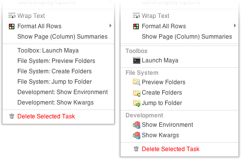

.. _index:

sgactions
=========

This Python package is a wrapper around ``ActionMenuItems`` in `Shotgun <http://www.shotgunsoftware.com/>`_ providing a simple interface to Python callables via a `YAML <http://www.yaml.org>`_ configuration. It also has an optional `Greasemonkey <http://en.wikipedia.org/wiki/Greasemonkey>`_-style user script to allow to injection of icons, and headings.

Installation
------------

Shotgun action menu items allow for execution of your code in two ways: via a ``POST`` to another webserver under your control, or navigating to an arbitrary URI. We hook into the second method via protocol handers on OS X and Linux by responding to the ``sgaction`` protocol. We have unified both cases into a single script::

    python -m sgactions.register

This script must be run once per user per machine. It is recommended to run this command on user login, and we have provided a ``launchctl`` agent which will perform this for you on OS X. Simply copy it to each user's home folder::

    mkdir -p ~/Library/LaunchAgents
    cp LaunchAgents/com.westernx.sgactions.plist ~/Library/LaunchAgents/

or into the system wide folder::

    cp LaunchAgents/com.westernx.sgactions.plist /Library/LaunchAgents/

This script will also automatically install our Google Chrome extension for adding icons, and headings. The changes will only take hold if the register command is run after Chrome has run for the first time and while Chrome is not running.

Whenever a new version of sgactions is installed, re-registering may be required, and it will clean up any old hooks it may have left in your system.

Configuration
-------------

Actions are specified in a `YAML <http://www.yaml.org>`_ file as a list of dictionaries, one for each action. A simple configuration looks like::

    - entrypoint: my.python.package:run_sgaction
      title: Run my action!

This will register "Run my action!" on every Shotgun entity to call ``run_sgaction`` within the ``my.python.package`` module.

We can specify the rest of the standard ``ActionMenuItem`` fields in a similar way::

    - entrypoint: my.python.package:run_sgaction
      title: Run my action on Shots or Tasks!
      entity_types: [Shot, Task]
      list_order: 1
      selection_required: true
      
Rich fields are added seperately to give you the oppourtunity to specify a different title for those browsers which will not render them richly. For example, one of the actions from the screenshot above are specified via::

    - entrypoint: sgfs.commands.launch_maya:sgaction
      title: "Toolbox: Launch Maya"
      rich:
          heading: Toolbox
          title: Launch Maya
          icon: application-osx-terminal
      list_order: 11
      entity_types: [Task]
      selection_required: true

We currently support the `Silk icon set <http://www.famfamfam.com/lab/icons/silk/>`_; simply replace underscores with dashes.

Deployment
----------

Deploying actions is a matter of calling the deployment script and giving it a configuration file::

    python -m sgactions.deploy my_actions.yml

This will install new actions, and update old ones (comparing them by their entrypoint). You must manually delete them via::

    python -m sgactions.deploy --list
    python -m sgactions.deploy --delete <entrypoint or id from previous list>

Writing Handlers
----------------

Action handlers are any Python callable that accept keyword arguments. The following is a simple example::

    def sgaction(**kwargs):
        for item in sorted(kwargs.iteritems()):
            print '%s = %r' % item

and on a Task on our testing server outputs::

    cols = ['content', 'step', 'sg_sort_order', 'task_assignees', 'sg_status_list', 'start_date', 'due_date', 'duration', 'milestone']
    column_display_names = ['Task Name', 'Pipeline Step', 'Sort Order', 'Assigned To', 'Status', 'Start', 'End', 'Duration', 'Milestone']
    entity_type = 'Task'
    ids = [43588, 43587, 43590]
    page_id = 992
    project_id = 66
    project_name = 'Testing Sandbox'
    referrer_path = '/detail/Shot/5773'
    selected_ids = [43589]
    server_hostname = '<snipped>'
    session_uuid = '<snipped>'
    sort_column = 'sg_sort_order'
    sort_direction = 'asc'
    title = 'Shot'
    user_id = 108
    user_login = '<snipped>'
    
Of particular interest is ``project_id``, which will appear in most cases and so may appear to be a constant argument, but it will not be passed along from cross-project pages, such as user pages.

Debugging
---------

Standard output is dumped to ``/var/log/system.log`` on OS X (accessible via ``Console.app``), and ``~/.xsession-errors`` on Linux.

